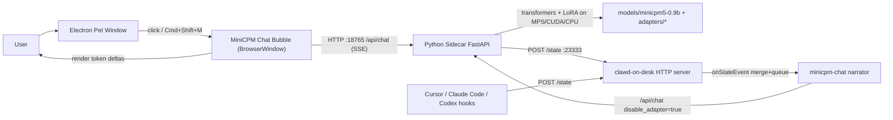
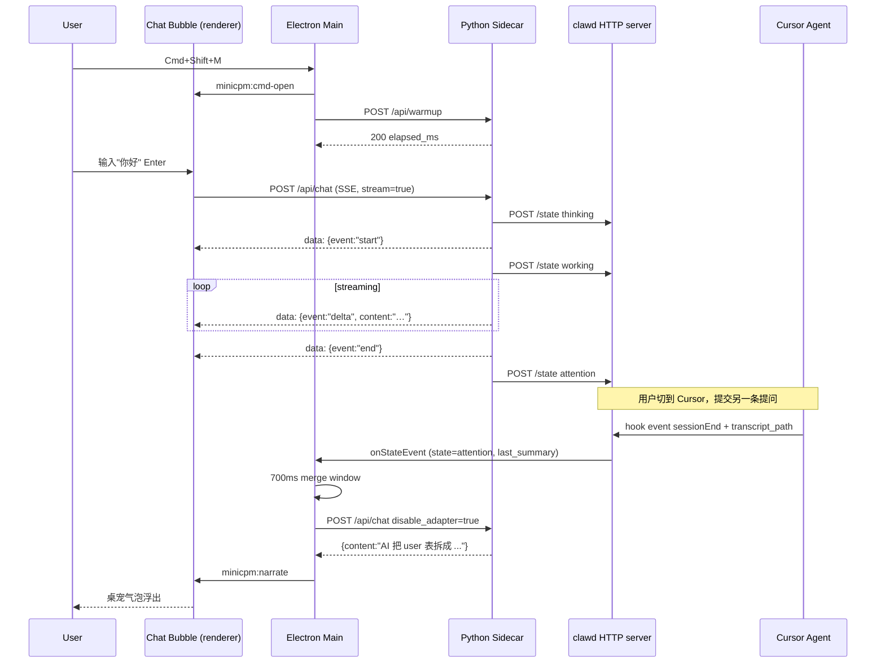

# MiniCPM-test 架构调研与三端打包改造报告

> 生成日期：2026-05-20  
> 调研范围：整个仓库（截至 v0.7 HEAD）  
> 目的：（1）盘点当前能力与架构，便于新接手成员快速了解；（2）评估将本项目作为桌面应用打包分发到 macOS / Windows / Linux 所需的工程改动。
>
> **v0.8 勘误**：报告中"PyTorch sidecar + PyInstaller 嵌入 torch"的设计已被 [`minicpm-sidecar/`](../minicpm-sidecar/) （llama.cpp + 瘦 gateway）取代。本报告中 §6.1 / §6.4 / §1.5.2 中关于 torch wheel 分发、MPS workaround、PyInstaller torch 体积的章节请以 [`docs/llama-cpp-migration.md`](llama-cpp-migration.md) 为准。其它跨平台分析（底座三端能力、Onboarding、签名、自动更新）仍然适用。

---

## 1. 摘要

- **项目定位**：本仓库是一个本地端侧 AI 桌面应用的实验项目。核心是把开源小模型 **MiniCPM5-0.9B** 跑在端上（Apple Silicon 上走 MPS），用 Electron 桌宠（fork 自 [rullerzhou-afk/clawd-on-desk](https://github.com/rullerzhou-afk/clawd-on-desk) @5b1f003）作为 UI 层，再通过 hook 体系把 Cursor / Claude Code / Codex 等 coding agent 的事件汇聚到桌宠，让桌宠主动旁白。
- **当前形态**：唯一被闭环验证的平台是 **macOS（Apple Silicon / MPS）**。底座 `clawd-on-desk` 在 [AGENTS.md](../clawd-on-desk/AGENTS.md) 中声称已经覆盖 Windows / macOS / Linux，但本仓库新加的 **MiniCPM 集成层**（聊天气泡、sidecar 管理、narration）**只针对 mac 写了路径与 spawn 逻辑**，Windows 直接挂、Linux 部分能跑。
- **三端目标可达性结论**：
  - UI（Electron 桌宠 + 聊天气泡）层迁移成本低，主要是窗口 type 已有降级；
  - Python 推理 sidecar 的 **解释器查找、spawn 命令、torch wheel 索引、模型权重分发** 四件事是阻塞项；
  - 启动脚本 `go.sh` 与 electron-builder 产物之间缺一座桥：当前没有把 sidecar 打进安装包，也没有 Windows PowerShell 等价脚本；
  - 模型权重（~2GB）不在仓库内，分发策略需要新增（推荐复用现有 `/api/update-apply` 的 hf:// 后端）。

预计三批次工作量：起步 1–2 天，可分发 3–5 天，生产可发 2–3 天。详见第 8 节。

---

## 1.5 底座现状与 sidecar 引入边界

在动手改造之前需要先回答两个问题：

> Q1：底座 Claude On Desk 是不是已经能在 Mac / Windows / Linux 三端用安装包直接装？  
> Q2：那么"在原始项目基础上加上 sidecar 引入推理环境"，是否就具备端侧推理的分发条件？

### 1.5.1 底座三端分发现状

**结论：是，三端都已经具备"用安装包直接装"的成熟度**。证据来自 [clawd-on-desk/docs/guides/setup-guide.md L157-L174](../clawd-on-desk/docs/guides/setup-guide.md) 和 [release-v0.7.1.md](../clawd-on-desk/docs/releases/release-v0.7.1.md)：

| 平台 | 安装包 | 自动更新 | 状态 |
|------|--------|----------|------|
| macOS | `dmg`，Intel + Apple Silicon 通用 | ❌ packaged 不支持 | ⚠️ **未签 Apple Developer 证书**，首次打开必须右键 → Open 或 `xattr -cr /Applications/Clawd\ on\ Desk.app` 绕开 Gatekeeper |
| Windows x64 | `Clawd-on-Desk-Setup-<ver>-x64.exe`（NSIS） | ✅ `electron-updater` 同架构升级 | ✅ 成熟 |
| Windows ARM64 | `Clawd-on-Desk-Setup-<ver>-arm64.exe`（NSIS） | ✅ | ✅ 成熟 |
| Linux x64 | `AppImage` + `.deb`（GNOME 菜单可见） | ❌ packaged 不支持 | ⚠️ 终端聚焦需要 `wmctrl` 或 `xdotool` |

发布渠道：[rullerzhou-afk/clawd-on-desk Releases](https://github.com/rullerzhou-afk/clawd-on-desk/releases)；本仓库 fork 的版本是 0.7.1。底座代码层已经替三端做完了关键适配（[release-v0.7.1.md](../clawd-on-desk/docs/releases/release-v0.7.1.md)）：

- Windows：`wmic` → `Get-CimInstance` 换代、PowerShell 终端聚焦、`koffi` FFI 控制前台窗口、Codex hook 走 PowerShell 格式；
- Linux：`wmctrl` / `xdotool` 终端聚焦、AppImage + deb 双包；
- macOS：panel window、Login Item、LSUIElement 隐藏 dock 图标、cmux 通过 Spotlight 解析。

**两个必须提前知道的尾巴**（[known-limitations.md](../clawd-on-desk/docs/guides/known-limitations.md)）：

1. **macOS DMG 未签名**：终端用户必须懂得绕 Gatekeeper，否则会以为应用坏了。
2. **macOS / Linux packaged 安装没有自动更新**：只能 git clone + npm start 形态下用 `git pull` 自更新；发版需要用户手动到 Releases 下载新包。Windows 是唯一支持 `electron-updater` 的平台。

### 1.5.2 "加 sidecar 就具备端侧推理条件" 这个判断对吗？

**结论：sidecar 是核心，但只把它装上还不够。至少要再配齐 4 件事**才算"具备端侧推理的分发条件"。

下面按"必备项"和"不做也能跑但体验会塌的项"两档展开。

#### 必备项（缺一个就跑不起来）

##### A. sidecar 的跨平台启动器

本仓库新加的 [minicpm-chat.js](../clawd-on-desk/src/minicpm-chat.js) 中 `locatePython()`（[L62-L80](../clawd-on-desk/src/minicpm-chat.js)）只查 mac 风格 conda 路径；`_spawnAndWait` 的 `viaShell` 分支只用 `/bin/bash`（[L213-L220](../clawd-on-desk/src/minicpm-chat.js)）。Windows 上根本拉不起来 sidecar。

加 sidecar **不等于** 复用底座的跨平台能力——sidecar 的 spawn 逻辑必须自己写平台分支（具体片段见 § 6.3）。

##### B. Python 推理运行时本身的跨端分发

`torch` + `transformers` + `peft` 这套东西在三端的安装方式完全不一样：

| 平台 | 默认 PyPI wheel | 加速后端 | 体积 |
|------|----------------|----------|------|
| macOS arm64 | 直拉 PyPI 即可 | MPS（内置） | torch ~250 MB |
| macOS x64 | 直拉 PyPI 即可 | CPU only | torch ~250 MB |
| Linux x64 + Nvidia | 必须指定 `--extra-index-url https://download.pytorch.org/whl/cu121` | CUDA | torch ~2 GB |
| Linux x64 无 GPU | 默认 wheel | CPU | torch ~250 MB |
| Windows x64 + Nvidia | 同 Linux | CUDA | 同 |
| Windows x64 无 GPU | 默认 wheel | CPU | 同 |
| Windows ARM64 | PyTorch **尚未发布官方 wheel**（截至 2026-05） | 暂无 | 需 x64 模拟或暂不支持 |

意味着不可能用一份 wheel 覆盖三端，至少要做两件事之一：

- **方案 B**（推荐，详见 § 6.1）：用 PyInstaller 在每个平台单独编译 sidecar，把 torch 一并嵌入。每个安装包 ~700 MB–1 GB；
- **方案 A**：要求终端用户自带 Python + uv，首启 `uv sync`，平台分发的就只有几个 .py，但体验差。

##### C. 模型权重的分发渠道

模型 `models/minicpm5-0.9b/` ~2 GB，**不能进安装包**（[.gitignore L15](../.gitignore) 已显式排除）。需要：

- 首次启动检测 `<userData>/models/minicpm5-0.9b/config.json` 缺失 → 引导下载；
- 复用现有 [updater.py](../minicpm-pet-bridge/updater.py) 的 `HFBackend.snapshot_download`（[L169-L184](../minicpm-pet-bridge/updater.py)），把默认 `MINICPM_UPDATE_SOURCE` 改为 `hf://openbmb/MiniCPM5-0.9B`；
- 提供"指定本地模型目录"覆盖入口（公司内网用户场景）。

##### D. 启动脚本的边界

`go.sh` 写死 `uname == "Darwin"`（[L94](../go.sh)），不能在 Windows 跑。但更关键的是：**NSIS / dmg / AppImage 内并不会带 `go.sh` / `go.ps1`**——packaged 应用启动 sidecar 应该完全由 Electron 主进程内部完成。换句话说，方案 B（PyInstaller 二进制）成立时，`go.*` 脚本只是开发 / dogfood 用，不影响终端用户。

#### 不做也能跑、但体验会塌的项

##### E. GPU 加速分流

0.9B 模型在不同硬件上的体验天差地别：

| 硬件 | 速率 | 评价 |
|------|------|------|
| mac arm64 / MPS（bf16） | ~30–60 tok/s | 流畅 |
| Linux / Windows + Nvidia（bf16） | ~50–100 tok/s | 最佳 |
| 一般笔记本纯 CPU | ~1–3 tok/s | **不可用**——narration 一句话要 30 秒 |

建议在 Settings 提供"加速器选择"，并对纯 CPU 的小设备给提示，甚至直接禁用 narration 等高频功能。

##### F. macOS 签名 / Windows 代码签名

底座 dmg 目前未签名，加了 sidecar 后首次启动既要绕 Gatekeeper 又要等 2 GB 模型下载，差体验会叠加。Windows 上没签名会被 SmartScreen 标红，企业内分发会被防病毒拦截。

##### G. 自动更新

底座 known-limitations 已明示"macOS / Linux packaged 不支持自动更新"。**模型与适配器**可以走 sidecar 自身的 `/api/update-apply`（已实现），但 **Electron 应用本体**只能在 Windows 上 `electron-updater`，mac / Linux 用户必须手动重装。这是底座已有的限制，加 sidecar 不会让它变好但也不会变坏。

### 1.5.3 评估总表

| 维度 | 底座 Claude On Desk | 当前 MiniCPM 集成层 | "底座 + sidecar" 想分发还差什么 |
|------|---------------------|--------------------|------|
| mac dmg | ✅ 可安装（未签名） | ⚠️ 路径硬编码，packaged 启动失败 | A、C |
| win exe | ✅ 可安装 + 自动更新 | ❌ 完全不工作（`/bin/bash` spawn） | A、B、C、D |
| linux AppImage/deb | ✅ 可安装 | ⚠️ Linux conda 路径未覆盖，spawn 大致能跑 | A、B、C |
| GPU 加速 | 不关心 | 仅 mac MPS | B、E |
| 模型分发 | 不涉及 | 协作者手动 `scp` | C |
| 自动更新 | win ✅ / mac、linux ❌ | sidecar 自带 `/api/update-apply` | G（底座限制） |
| 签名 / 上架 | ❌ 未签 | 不涉及 | F |

### 1.5.4 工程结论

1. **底座本身确实已经具备三端 exe/dmg/AppImage 直接安装的能力**，并且这是 [rullerzhou-afk/clawd-on-desk](https://github.com/rullerzhou-afk/clawd-on-desk) 官方仓库已经在维护的发布流。
2. **只把当前这套 sidecar "原封不动"塞进去**仍然只能在 mac 上跑——核心阻塞点不是底座，是 sidecar 自己的 spawn / wheel / 权重分发逻辑。
3. **真正"具备端侧推理分发条件"的最小集合 = A + B + C + D**，分别对应本报告 § 6.3、§ 6.4、§ 6.2、§ 6.5。预算 1–2 天解锁开发自测，3–5 天出第一份可分发安装包。
4. **如果目标是"商用级"分发**（用户双击就用、不告诉他绕 Gatekeeper），还需要 F（签名）+ G（自动更新策略）+ E（CPU 设备的降级体验）。这一层底座本身就有遗留限制（mac / linux packaged 无自更新、底座 dmg 未签名），不是引入 sidecar 才有的问题，但需要在产品决策时一并评估。

---

## 2. 仓库结构与能力盘点

### 2.1 顶层结构

```
MiniCPM-test/
├── clawd-on-desk/              ← Electron 桌宠 (vendored fork) + MiniCPM 集成层
├── minicpm-pet-bridge/         ← Python sidecar 原始 conda 版（FastAPI + transformers + MPS）
├── minicpm-pet-bridge-uv/      ← 同源 sidecar 的 uv 版（推荐分发）
├── adapters/                   ← LoRA 适配器（含猫娘版）
├── skills/deploy-minicpm-pet/  ← Cursor Agent Skill，引导协作者部署
├── go.sh                       ← 一键脚本（uv 路径，仅 macOS 验证）
├── CHANGELOG.md                ← v0.2 变更日志
└── README.md
```

**不在 git 内** 的关键资源：

| 路径 | 体积 | 来源 | 备注 |
|------|------|------|------|
| `models/minicpm5-0.9b/` | ~2 GB BF16 权重 | 协作者自带 / HF download | `.gitignore` 中显式排除（[.gitignore L15](../.gitignore)） |
| `clawd-on-desk/node_modules/` | ~500 MB | `npm install` 生成 | |
| `minicpm-pet-bridge-uv/.venv/` | ~3 GB（含 torch） | `uv sync` 生成 | |

### 2.2 当前能力清单

| 能力 | 入口 / 触发 | 实现位置 |
|------|--------------|-----------|
| 本地聊天气泡 | `⌘⇧M` 开关 / 点击桌宠 | [clawd-on-desk/src/minicpm-chat.js](../clawd-on-desk/src/minicpm-chat.js) + [minicpm-chat.html](../clawd-on-desk/src/minicpm-chat.html) |
| 思考模式切换 | `⌘⇧T` | `minicpm-chat.js` `toggleThinking()` |
| 流式生成（SSE） | `POST /api/chat` `stream=true` | [server.py `_stream_chat`](../minicpm-pet-bridge/server.py) |
| 思考块过滤 | `<think>…</think>` 自动解析 | `server.py` `ThinkBlockFilter` |
| LoRA 切换 + 卸载 | 聊天里说"用猫娘"/"切回原版" / Settings → 🐾 MiniCPM | `/api/load-adapter`，`engine.swap_adapter` |
| 模糊意图分类 | 单次 forward 比较候选首 token logit | `/api/classify`，`engine.classify` |
| 桌宠主动旁白 | Cursor / Claude / Codex 完成事件触发 | `minicpm-chat.js` `onStateEvent → dispatchNarration` |
| narration FIFO 队列 + 事件 merge | 多 IDE 同时完成时按 transcript 富度评分排队 | `minicpm-chat.js` `eventBuffers`、`queuedEvents` |
| Settings → 🐾 MiniCPM tab | 状态 / 更新 / 适配器 / 生成参数 / 气泡位置 / 旁白开关 | [src/settings-tab-minicpm.js](../clawd-on-desk/src/settings-tab-minicpm.js) |
| 模型自动更新（mock + hf） | `Settings → 模型更新` 或气泡右键 | [updater.py](../minicpm-pet-bridge/updater.py)，`/api/update-apply` SSE |
| 双路 warmup | 启动时预热采样 + 贪心 kernel | `server.py` `ChatEngine._warmup` |
| 单 token warmup ping | 打开气泡时 fault back 权重 | `/api/warmup` |
| Sidecar → Clawd 反向状态推送 | 端口扫描 23333–23337 | [clawd_state.py](../minicpm-pet-bridge/clawd_state.py) |
| 气泡拖动定位（持久化） | Settings 进入拖动模式 → 保存 (dx, dy) | `minicpm-chat.js` `BUBBLE_POS_PATH` |
| 派生状态 overload / failure-streak | `working > 5min` 或 `StopFailure × 3` | [main.js L1125-L1192](../clawd-on-desk/src/main.js) |

---

## 3. 总体架构与数据流

### 3.1 模块拓扑



### 3.2 一次完整聊天 + narration 的事件时序



---

## 4. 关键模块责任与端点矩阵

### 4.1 Electron 主进程

| 模块 | 责任 |
|------|------|
| [src/main.js](../clawd-on-desk/src/main.js) | 主进程胶水：窗口、IPC、托盘、全局快捷键；引入 `minicpm-chat` 并接 `/state` 事件转发到 narrator（[L1254-L1260](../clawd-on-desk/src/main.js)）；派生 overload / failure-streak（[L1125-L1192](../clawd-on-desk/src/main.js)） |
| [src/minicpm-chat.js](../clawd-on-desk/src/minicpm-chat.js) | sidecar 生命周期、气泡 BrowserWindow、narration pipeline、IPC handler、参数 / 气泡位置持久化（`<userData>/minicpm-prefs.json`、`minicpm-bubble-pos.json`） |
| [src/preload-minicpm-chat.js](../clawd-on-desk/src/preload-minicpm-chat.js) | 给气泡 renderer 注入 `window.minicpm` 与 `window.minicpmSettings` IPC API |
| [src/settings-tab-minicpm.js](../clawd-on-desk/src/settings-tab-minicpm.js) | Settings 窗口里的 🐾 MiniCPM tab：状态 / 更新 / 适配器 / 生成参数 / 气泡位置 / 旁白 |
| [src/server.js](../clawd-on-desk/src/server.js) | 桌宠侧 `/state` `/permission` HTTP 服务（23333–23337），sidecar 反向推送的接收端 |

### 4.2 Python sidecar 端点矩阵

均挂在 `http://127.0.0.1:18765`，FastAPI。详见 [server.py](../minicpm-pet-bridge/server.py)。

| Method | Path | 用途 | 关键参数 / 返回 |
|--------|------|------|----------------|
| GET | `/api/health` | 探活 + 当前模型 / adapter / persona / device / dtype | `{ok, device, dtype, model_dir, model_name, adapter, persona}` |
| GET | `/api/models` | 扫描 `models-root` 下所有 HF 模型目录 | `{items, current, current_name}` |
| POST | `/api/load-model` | 切换基座模型 | `{path}` |
| GET | `/api/adapters` | 扫描 `adapters/` 下所有 PEFT 适配器 | `{items, current, current_name}` |
| POST | `/api/load-adapter` | 切换 / 卸载 LoRA | `{path}` 或 `{}` 卸载 |
| POST | `/api/chat` | 聊天主入口（流式或一次性） | `ChatRequest`（见下） |
| POST | `/api/warmup` | 1 token greedy forward，fault back 权重 | `{ok, elapsed_ms}` |
| POST | `/api/classify` | 单次 forward，首 token logit 比较候选 | `{winner, scores, calibrated, baseline}` |
| GET | `/api/update-check` | 本地 vs 远端 revision 比较 | `{available, local_revision, remote_revision, ...}` |
| POST | `/api/update-apply` | 流式应用更新（SSE） | `data: {phase: "start"\|"transfer"\|"swap"\|"complete"\|"reloaded"}` |
| POST | `/api/state` | 手动触发桌宠状态切换 | `{state, event}` |
| GET | `/` + `/static/*` | 自带的浏览器测试页（开发用） | |

**ChatRequest** 关键字段（[server.py L105-L116](../minicpm-pet-bridge/server.py)）：

```python
class ChatRequest(BaseModel):
    messages: List[ChatMessage]
    max_new_tokens: int = 512
    temperature: float = 0.6
    top_p: float = 0.95
    top_k: int = 0
    repetition_penalty: float = 1.05
    stream: bool = True
    system: Optional[str] = None
    thinking: bool = False         # 是否暴露 <think> 块
    silent: bool = False           # narration / 后台调用：不推桌宠状态
    disable_adapter: bool = False  # narration：跳过 LoRA，走 base 模型
```

### 4.3 Python sidecar 内部组件

| 组件 | 责任 |
|------|------|
| `ChatEngine` | 单 flight 推理（`_lock`），LoRA 热替换（`swap_adapter` 走 PeftModel.from_pretrained），device/dtype 自动选择，`/api/warmup` 与启动 `_warmup` 双路热身 |
| `ThinkBlockFilter` | 流式解析 `<think>…</think>`，按 `expose` 决定输出 think 或 delta 事件，buffer tail 半 tag 防护 |
| `ClawdBridge` | 缓存端口、扫描 23333–23337、用 `claude-code` agent_id 复用动画映射 |
| `ModelUpdater` + `MockBackend` / `HFBackend` | 双后端、`revision.json` 协议、原子 swap（`os.replace` 当前目录 ↔ `.update-staging` ↔ `.bak`） |

### 4.4 启动脚本与 skill

| 文件 | 用途 |
|------|------|
| [go.sh](../go.sh) | macOS 一键脚本：检 Node 18+ / uv，缺则 brew/fnm/curl 自装，`uv sync` + `npm install` + `npm start` |
| [minicpm-pet-bridge/start.sh](../minicpm-pet-bridge/start.sh) | 原始 conda 路径独立启动 |
| [minicpm-pet-bridge-uv/run.sh](../minicpm-pet-bridge-uv/run.sh) | uv 路径独立启动 |
| [skills/deploy-minicpm-pet/SKILL.md](../skills/deploy-minicpm-pet/SKILL.md) | Cursor Agent 触发的部署引导 |

---

## 5. 当前平台耦合点（评估三端打包的依据）

以下是仓库中所有明确假设 macOS / Apple Silicon 的位置。**这些是三端打包必须改造的核心点**。

| 位置 | 假设 | 风险 |
|------|------|------|
| [minicpm-chat.js L28-L30](../clawd-on-desk/src/minicpm-chat.js) | `isMac/isWin/isLinux` 已分支，UI 层 OK | 仅作记录 |
| [minicpm-chat.js L52](../clawd-on-desk/src/minicpm-chat.js) | `locateBridgeDir()` 后备路径写死 `~/Downloads/Minicpm/minicpm-pet-bridge` | Win/Linux 用户没有此布局 |
| [minicpm-chat.js L62-L80](../clawd-on-desk/src/minicpm-chat.js) | `locatePython()` 仅查 `~/miniconda3`、`~/anaconda3`、`/opt/miniconda3`、`/opt/anaconda3`、`/opt/homebrew/Caskroom/miniconda/...`，全是 macOS Unix 风格路径 | Windows 上必然 fall-through 到 `viaShell: true` |
| [minicpm-chat.js L213-L220](../clawd-on-desk/src/minicpm-chat.js) | `viaShell` 分支用 `spawn("/bin/bash", ["-lc", "eval $(conda shell.bash hook) && conda activate ... && exec python ..."])` | Windows 没有 `/bin/bash`，直接 ENOENT |
| [minicpm-chat.js L564-L565](../clawd-on-desk/src/minicpm-chat.js) | `type: "panel"` 仅 mac；`splash` 已为 linux fallback；`isWin` 已有 `setAlwaysOnTop(true, "pop-up-menu")` 兜底 | Win/Linux 行为需手测 |
| [server.py L258-L279](../minicpm-pet-bridge/server.py) | `_pick_device`：MPS → CUDA → CPU；`_pick_dtype` 自动选择在 MPS 强制 bf16 | Windows + CUDA 上 bf16 仅 Ampere+ 支持；CPU 上 bf16 太慢，需要 fp32 兜底 |
| [pyproject.toml L11-L23](../minicpm-pet-bridge-uv/pyproject.toml) | `torch>=2.4.0,<2.7` 直接走 PyPI 通用 wheel | mac arm64 PyPI 自带 MPS；Linux/Windows 想要 CUDA 必须额外指定 `--extra-index-url https://download.pytorch.org/whl/cu121`；不指定就是 CPU-only |
| [go.sh L94-L98](../go.sh) | `uname == "Darwin"` 才完整工作 | Linux 大部分能跑（uv / fnm / curl 都支持），Win 完全跑不起来 |
| [clawd_state.py L20-L21](../minicpm-pet-bridge/clawd_state.py) | `RUNTIME_FILE = Path.home() / ".clawd" / "runtime.json"` | 三端 `Path.home()` 都能解析，但需要确认 Electron 端 `app.getPath('userData')` 与此目录约定不冲突 |
| [updater.py L262-L290](../minicpm-pet-bridge/updater.py) | `os.replace(staging, local_model_dir)` 跨卷会失败 | Windows 上模型可能放在 D: 而 staging 在 C:，需要 `shutil.move` 兜底 |
| 模型权重 ~2GB + LoRA ~22MB | 不在仓库 | 没有面向终端用户的分发机制，目前依赖协作者手动 `scp` 或 `hf download` |

> 旁注：底座 fork [clawd-on-desk/AGENTS.md](../clawd-on-desk/AGENTS.md) 自身声称跨平台，里面已有大量 Windows / Linux 兼容代码（taskbar、koffi FFI、Codex PowerShell hook 等），相对成熟。**真正需要补的是本仓库新加的 MiniCPM 集成层。**

---

## 6. 三端打包分发改造方案

### 6.1 Python sidecar 分发策略选型

桌面应用要把 Python 推理服务"打成普通用户能双击就跑"的形态，有三个层级的方案：

| 方案 | 终端用户感知 | 包体积 | 实施成本 | 适用阶段 |
|------|--------------|--------|----------|-----------|
| **A. 要求用户自带 Python + uv** | 安装时弹"请先装 Python 3.11 + uv"，首启 `uv sync` 等几分钟 | 安装包 ~150 MB（只含 .py + uv.lock） | 1 天，改动小 | 内部 dogfood |
| **B. PyInstaller / Nuitka 编 sidecar 单文件** (**推荐**) | 双击即用，sidecar 是一个 ~600 MB-1 GB 的二进制 | mac dmg 700 MB、win NSIS 800 MB、linux AppImage 800 MB | 3–5 天，首次踩 hidden-imports 坑 | 公测、生产分发 |
| **C. python-build-standalone 嵌入便携 Python + 锁定 venv** | 双击即用，体积接近方案 B，但更新只需替换 .py | 略小于 B（torch wheel 不会被 PyInstaller 二次膨胀） | 4–6 天，需要写跨平台 bootstrap | 后期需要快速分发模型 / 代码热更新时 |

**推荐方案 B**，理由：
1. PyInstaller 已经是 Python 桌面应用事实标准；
2. 单文件二进制启动时间可控（torch warmup 在 sidecar 内部一次性付清）；
3. 与现有 `Sidecar` 类几乎不冲突——只需要把 `args = ["server.py", ...]` 换成 `[]`、`spawn(pythonExe, args)` 换成 `spawn(sidecarBin, args)`。

#### PyInstaller spec 草稿（要点）

```python
# build/sidecar.spec
from PyInstaller.utils.hooks import collect_submodules, collect_data_files

block_cipher = None

hidden = (
    collect_submodules("transformers.models")
    + collect_submodules("peft.tuners")
    + collect_submodules("accelerate.utils")
    + ["sentencepiece", "tokenizers", "safetensors"]
)

datas = (
    collect_data_files("transformers", include_py_files=False)
    + collect_data_files("tokenizers")
    + collect_data_files("sentencepiece")
)

a = Analysis(
    ["../minicpm-pet-bridge-uv/server.py"],
    pathex=["../minicpm-pet-bridge-uv"],
    binaries=[],
    datas=datas,
    hiddenimports=hidden,
    hookspath=[],
    excludes=["matplotlib", "scipy.misc", "tkinter"],
)

pyz = PYZ(a.pure, a.zipped_data, cipher=block_cipher)
exe = EXE(
    pyz, a.scripts, [], exclude_binaries=True,
    name="minicpm-sidecar",
    debug=False, strip=False, upx=False, console=True,
)
coll = COLLECT(exe, a.binaries, a.datas, name="minicpm-sidecar")
```

注意：
- PyTorch 的 `.dylib` / `.so` / `.dll`、`tokenizers` 内部的 Rust 静态库、`sentencepiece` 的 C++ shared lib、`safetensors` 的 PyO3 模块都需要进 `binaries`。漏一个就是运行期 `cannot find ...`，靠 CI smoke test 兜。
- 强烈建议把 `transformers.models.minicpm5` 显式加入 hidden imports（trust_remote_code 路径，PyInstaller 默认不会扫描）。

### 6.2 模型与适配器分发

模型权重 ~2 GB，**不应进安装包**（dmg/exe 在 1 GB 以下用户体验明显更好，超过后下载和首次启动都会被吐槽）。建议：

1. **首启引导下载**：复用已有的 `/api/update-apply` SSE 流程。当前 `HFBackend` 已经实现了 `huggingface_hub.snapshot_download`（[updater.py L169-L184](../minicpm-pet-bridge/updater.py)）。
   - 默认 `MINICPM_UPDATE_SOURCE=hf://openbmb/MiniCPM5-0.9B`；
   - 首次打开 Settings → 🐾 MiniCPM → 当前状态时检测模型缺失，弹"下载模型"按钮 + 进度条；
   - 下载位置改为跨平台 `app.getPath('userData')/models/minicpm5-0.9b`，而不是写死 `<repo>/models/`。
2. **LoRA 打进安装包**：`adapters/lora_nekoqa_adapter_*` 仅 22 MB，可以通过 electron-builder `extraResources` 一起发，省去额外下载。
3. **支持本地路径覆盖**：Settings 提供"指定模型目录"入口，写入 `<userData>/minicpm-prefs.json` 的 `model_dir` 字段，sidecar 启动时通过 `--model` 注入。

### 6.3 Electron 侧改造（具体到文件 + 片段）

#### 6.3.1 `clawd-on-desk/src/minicpm-chat.js`

**修改 `locatePython()`，覆盖三端**：

```js
function locatePython() {
  const explicit = process.env.MINICPM_PYTHON;
  if (explicit && fs.existsSync(explicit)) return { python: explicit, viaShell: false };

  // Packaged 模式：sidecar 是一个 PyInstaller 产物，根本不需要 Python 解释器
  if (app.isPackaged) {
    const ext = process.platform === "win32" ? ".exe" : "";
    const bin = path.join(process.resourcesPath, "sidecar-bin", "minicpm-sidecar" + ext);
    if (fs.existsSync(bin)) return { python: null, sidecarBin: bin, viaShell: false };
  }

  const envName = process.env.MINICPM_CONDA_ENV || "minicpm-pet";
  const home = os.homedir();
  const isWin = process.platform === "win32";

  const candidates = isWin ? [
    path.join(home, "miniconda3", "envs", envName, "python.exe"),
    path.join(home, "anaconda3", "envs", envName, "python.exe"),
    path.join(home, ".pyenv-win", "pyenv-win", "versions", "3.11.9", "python.exe"),
    path.join(process.env.LOCALAPPDATA || "", "Programs", "Python", "Python311", "python.exe"),
    path.join(home, ".local", "share", "uv", "python", "cpython-3.11.9-windows-x86_64-none", "python.exe"),
  ] : [
    path.join(home, "miniconda3", "envs", envName, "bin", "python"),
    path.join(home, "anaconda3", "envs", envName, "bin", "python"),
    "/opt/miniconda3/envs/" + envName + "/bin/python",
    "/opt/anaconda3/envs/" + envName + "/bin/python",
    "/opt/homebrew/Caskroom/miniconda/base/envs/" + envName + "/bin/python",
    "/usr/bin/python3",
    path.join(home, ".local", "share", "uv", "python", "cpython-3.11.9-*", "bin", "python"),
  ];

  for (const p of candidates) {
    try { if (fs.statSync(p).isFile()) return { python: p, viaShell: false }; } catch {}
  }
  return { python: null, viaShell: true, condaEnv: envName };
}
```

**修改 `_spawnAndWait`，把硬编码 `/bin/bash` 改成平台分支**：

```js
let proc;
if (sidecarBin) {
  // PyInstaller 产物：直接 spawn 二进制
  proc = spawn(sidecarBin, ["--host", this.host, "--port", String(this.port), ...modelArgs], { cwd: this.bridgeDir, env });
} else if (python) {
  proc = spawn(python, args, { cwd: this.bridgeDir, env });
} else if (viaShell) {
  if (process.platform === "win32") {
    // Win：通过 cmd.exe 激活 conda
    const cmd = `call conda activate ${condaEnv} && python ${args.join(" ")}`;
    proc = spawn("cmd.exe", ["/c", cmd], { cwd: this.bridgeDir, env, windowsHide: true });
  } else {
    const cmd = [
      `eval "$(conda shell.bash hook)"`,
      `conda activate ${condaEnv}`,
      `exec python ${args.map((a) => `'${a.replace(/'/g, "'\\''")}'`).join(" ")}`,
    ].join(" && ");
    proc = spawn("/bin/bash", ["-lc", cmd], { cwd: this.bridgeDir, env });
  }
} else {
  throw new Error("找不到 Python 解释器，请安装 Python 3.10+ 或重装应用。");
}
```

**修改 `locateBridgeDir()`，移除 `~/Downloads/Minicpm/...` 残留，加 packaged 分支**：

```js
function locateBridgeDir(appRoot) {
  const candidates = [
    process.env.MINICPM_BRIDGE_DIR,
    app.isPackaged ? path.join(process.resourcesPath, "minicpm-pet-bridge") : null,
    path.join(appRoot, "..", "minicpm-pet-bridge-uv"),
    path.join(appRoot, "..", "minicpm-pet-bridge"),
  ].filter(Boolean);
  // 余下逻辑不变
}
```

**全局快捷键提示**：当前快捷键写死 `⌘⇧M` / `⌘⇧T`，Electron 的 `globalShortcut.register("CommandOrControl+Shift+M", ...)` 已经天然跨平台。但 [src/minicpm-chat.js](../clawd-on-desk/src/minicpm-chat.js) 内显示的提示文案需要根据 `process.platform` 切换：

```js
const HOTKEY_OPEN = isMac ? "⌘⇧M" : "Ctrl+Shift+M";
```

并同步更新 [src/settings-tab-minicpm.js](../clawd-on-desk/src/settings-tab-minicpm.js) 中显示的快捷键文案（当前 hardcode 为 `⌘⇧M` / `⌘⇧T`）。

#### 6.3.2 `clawd-on-desk/package.json` `build`

当前 [package.json L112-L137](../clawd-on-desk/package.json) 的 `files` / `asarUnpack` / `extraResources` 只考虑了底座桌宠资源。需要追加 MiniCPM sidecar 与 LoRA：

```jsonc
"extraResources": [
  { "from": "assets/icon.ico", "to": "icon.ico" },
  // sidecar 源代码（方案 A / C 用，方案 B 备用以便用户回滚）
  {
    "from": "../minicpm-pet-bridge-uv",
    "to": "minicpm-pet-bridge",
    "filter": ["server.py", "updater.py", "clawd_state.py", "pyproject.toml", "uv.lock", ".python-version"]
  },
  // PyInstaller 产物（方案 B 主路径）
  { "from": "../dist/sidecar/${os}-${arch}/", "to": "sidecar-bin" },
  // LoRA 适配器
  { "from": "../adapters", "to": "adapters" }
]
```

`${os}` / `${arch}` 是 electron-builder 内置占位符，会展开成 `mac`/`win`/`linux` 和 `x64`/`arm64`。需要在 CI 矩阵里先跑 PyInstaller 出对应产物。

`linux` 子配置补 `extraResources` 的执行权限保留：

```jsonc
"linux": {
  "executableArgs": [],
  "fileAssociations": []
}
```

AppImage 默认会复制权限位，但 deb 包需要 `linux.executable`，详见 electron-builder docs。

#### 6.3.3 窗口能力降级

[minicpm-chat.js L564-L573](../clawd-on-desk/src/minicpm-chat.js) 的窗口能力已有分支：

- mac：`type: "panel"` + `setVisibleOnAllWorkspaces(true, {visibleOnFullScreen: true})`
- linux：`type: "splash"`
- win：`setAlwaysOnTop(true, "pop-up-menu")`

**验证点**：Windows 上 `pop-up-menu` level 可能在用户切换桌面（Win+Tab）或打开 UAC 弹窗时被压住。底座 fork [AGENTS.md](../clawd-on-desk/AGENTS.md) 已经记录过类似坑：DWM + 透明窗的语言菜单截断问题。改 MiniCPM 气泡时，应**完整跑一遍 Settings → MiniCPM tab + 全屏游戏 + UAC 弹窗** 三种场景。

#### 6.3.4 IPC 兼容性

[preload-minicpm-chat.js](../clawd-on-desk/src/preload-minicpm-chat.js) 用的全是 `contextBridge.exposeInMainWorld` + `ipcRenderer.invoke`，与平台无关，无需改。

### 6.4 Python sidecar 改造

#### 6.4.1 `server.py` device/dtype 兜底

[server.py L258-L279](../minicpm-pet-bridge/server.py) 当前实现：

```python
@staticmethod
def _pick_dtype(dtype: str) -> torch.dtype:
    if dtype == "float32": return torch.float32
    if dtype == "float16": return torch.float16
    if dtype == "bfloat16": return torch.bfloat16
    if torch.backends.mps.is_available(): return torch.bfloat16
    if torch.cuda.is_available():
        return torch.bfloat16 if torch.cuda.is_bf16_supported() else torch.float16
    return torch.float32
```

需要额外补：

```python
# Windows + 旧消费级 GPU 上 bf16 会触发 "BFloat16 is not supported"，强制 fp16。
# Apple Silicon 也有少数 BF16 算子不支持的边角情形，转 fp16 fallback。
import platform
if torch.cuda.is_available():
    major, _ = torch.cuda.get_device_capability(0)
    if major < 8 and dtype == "auto":  # SM 8.0+ (Ampere+) 才能稳定跑 bf16
        return torch.float16

# 纯 CPU（笔记本无独显）走 fp32，因为 PyTorch CPU BF16 算子还不全
if not torch.backends.mps.is_available() and not torch.cuda.is_available():
    return torch.float32
```

启动日志加内存预检：

```python
if engine.device == "cpu":
    import psutil
    available_gb = psutil.virtual_memory().available / 2**30
    _safe_print(f"[engine] CPU mode, available RAM={available_gb:.1f} GB", flush=True)
    if available_gb < 4:
        _safe_print("[warn] 可用内存 < 4GB，模型可能无法加载", flush=True)
```

#### 6.4.2 `pyproject.toml` 平台分流 torch wheel

当前 [pyproject.toml L11-L23](../minicpm-pet-bridge-uv/pyproject.toml) 只声明了一行 `torch>=2.4.0,<2.7`。三端打包时建议拆成显式索引：

```toml
[project]
dependencies = [
  "torch>=2.4.0,<2.7",
  "transformers>=4.46.0,<4.55",
  "accelerate>=0.34.0",
  "peft>=0.13.0",
  "sentencepiece>=0.2.0",
  "protobuf>=4.25.0",
  "fastapi>=0.115.0",
  "uvicorn[standard]>=0.30.0",
  "pydantic>=2.7.0",
  "httpx>=0.27.0",
  "huggingface_hub>=0.25.0",
  "psutil>=5.9.0",
]

[tool.uv]
prerelease = "disallow"

# 关键：按平台路由 torch wheel
[tool.uv.sources]
torch = [
  { index = "pytorch-cpu",   marker = "sys_platform == 'win32' or (sys_platform == 'linux' and platform_machine == 'x86_64' and 'cuda' not in extra)" },
  { index = "pytorch-cuda",  marker = "extra == 'cuda'" },
  # macOS 不要指定 index，让 uv 直接从 PyPI 取（mac arm64 PyPI wheel 自带 MPS）
]

[[tool.uv.index]]
name = "pytorch-cpu"
url = "https://download.pytorch.org/whl/cpu"

[[tool.uv.index]]
name = "pytorch-cuda"
url = "https://download.pytorch.org/whl/cu121"

[project.optional-dependencies]
cuda = []  # 占位让 uv extras 路由生效
```

> uv 在 marker 表达式中对 extras 的支持仍在演进；如果不顺手，可以保留单一 dependencies + 通过环境变量 `UV_INDEX_URL` 在 CI 里按平台覆盖。

#### 6.4.3 `updater.py` 跨卷原子替换

[updater.py L284-L289](../minicpm-pet-bridge/updater.py)：

```python
if backup.exists(): shutil.rmtree(backup, ignore_errors=True)
if self.local_model_dir.exists(): os.replace(self.local_model_dir, backup)
os.replace(staging, self.local_model_dir)
```

Windows 上若 `staging` 和 `local_model_dir` 在不同盘符（用户把模型放到 D:\models，安装包默认下载到 C:\Users\...），`os.replace` 会抛 `OSError: [WinError 17]`。改造：

```python
def _atomic_move(src: Path, dst: Path) -> None:
    try:
        os.replace(src, dst)
    except OSError:
        shutil.move(str(src), str(dst))
```

并把所有 `os.replace` 调用换成 `_atomic_move`。

#### 6.4.4 默认 mock 路径

[updater.py L29-L32](../minicpm-pet-bridge/updater.py) `DEFAULT_SOURCE` 写死 `Path.home() / 'Downloads' / 'Minicpm' / '.mock-hf-remote' / ...`。生产发布时这个不应出现，建议：

```python
DEFAULT_SOURCE = os.environ.get(
    "MINICPM_UPDATE_SOURCE",
    "hf://openbmb/MiniCPM5-0.9B",  # 生产默认走 HF
)
```

mock 路径只在 dev 环境通过 `MINICPM_UPDATE_SOURCE` env 注入。

#### 6.4.5 `clawd_state.py`

无需改动：`httpx` + `Path.home()` 三端通用。

### 6.5 启动脚本与 CI

#### 6.5.1 `go.sh` 兼容 Linux

去掉 [go.sh L94-L98](../go.sh) 的 yellow warning（Linux 实际上能跑全流程），并补 Linux 包管理检测：

```bash
check_environment() {
  local plat
  case "$(uname)" in
    Darwin) plat="mac" ;;
    Linux) plat="linux" ;;
    *) red "不支持的平台: $(uname)"; exit 1 ;;
  esac
  green "    ✓ ${plat}"
  ensure_node
  ensure_uv
  # 其余不变
}
```

#### 6.5.2 新增 `go.ps1` for Windows

新建仓库根目录 `go.ps1`：

```powershell
# go.ps1 — 一键安装 + 启动 MiniCPM 桌宠 (Windows / uv 版)
param([string]$Cmd = "run")

$ErrorActionPreference = "Stop"
$Here = Split-Path -Parent $MyInvocation.MyCommand.Path
$BridgeDir = Join-Path $Here "minicpm-pet-bridge-uv"
$AppDir = Join-Path $Here "clawd-on-desk"
$ModelDir = Join-Path $Here "models\minicpm5-0.9b"

function Ensure-Node {
  if (Get-Command node -ErrorAction SilentlyContinue) {
    $ver = (node -v) -replace '^v', '' -replace '\..*', ''
    if ([int]$ver -ge 18) { return }
  }
  if (Get-Command winget -ErrorAction SilentlyContinue) {
    winget install OpenJS.NodeJS.LTS --silent --accept-source-agreements --accept-package-agreements
  } else {
    irm https://fnm.vercel.app/install.ps1 | iex
    fnm install 22; fnm use 22
  }
}

function Ensure-Uv {
  if (-not (Get-Command uv -ErrorAction SilentlyContinue)) {
    irm https://astral.sh/uv/install.ps1 | iex
    $env:Path = "$env:USERPROFILE\.local\bin;$env:Path"
  }
}

function Check-Model {
  if (-not (Test-Path "$ModelDir\config.json")) {
    Write-Error "找不到模型 $ModelDir\config.json，请先放好或运行 hf download。"
    exit 1
  }
}

switch ($Cmd) {
  "doctor" { Ensure-Node; Ensure-Uv; Check-Model; Write-Host "OK" }
  "setup"  { Ensure-Node; Ensure-Uv; Check-Model
             Push-Location $BridgeDir; uv sync; Pop-Location
             Push-Location $AppDir; npm install --no-audit --no-fund; Pop-Location }
  "start"  { $env:MINICPM_BRIDGE_DIR = $BridgeDir
             $env:MINICPM_PYTHON = "$BridgeDir\.venv\Scripts\python.exe"
             Push-Location $AppDir; npm start; Pop-Location }
  default  { & $PSCommandPath setup; & $PSCommandPath start }
}
```

#### 6.5.3 electron-builder 三端注意点

| 平台 | 当前配置 | 需要补 |
|------|----------|--------|
| mac | `dmg` x64+arm64，`LSUIElement: true`（无 dock 图标） | 公证：`afterSign` hook + 环境变量 `APPLE_ID` / `APPLE_APP_SPECIFIC_PASSWORD` / `APPLE_TEAM_ID` |
| win | NSIS x64+arm64，`signAndEditExecutable: false`，`artifactName` 已带 `${arch}` | 代码签名证书（避免 SmartScreen）：把 `signAndEditExecutable` 打开并配 `CSC_LINK` + `CSC_KEY_PASSWORD` |
| linux | AppImage x64 + deb x64 | 增补 arm64？需求评估；`extraResources` 中的 sidecar binary 必须 chmod +x（electron-builder 默认保留，但确认 PyInstaller 产物为 0755） |

#### 6.5.4 CI 矩阵（建议 GitHub Actions）

```yaml
strategy:
  matrix:
    include:
      - os: macos-14    # arm64
        py: "3.11"
        target: mac-arm64
      - os: macos-13    # x64
        py: "3.11"
        target: mac-x64
      - os: ubuntu-22.04
        py: "3.11"
        target: linux-x64
      - os: windows-2022
        py: "3.11"
        target: win-x64
```

每个 job 顺序：装 Python + uv → `uv sync` → PyInstaller build → `cp dist/sidecar -> ../dist/sidecar/${target}/` → `cd clawd-on-desk && npm ci && npm run build:${platform}`。

### 6.6 Hooks 跨平台兼容

底座 fork 已经在 [AGENTS.md](../clawd-on-desk/AGENTS.md) 中处理：

- Codex Windows command 必须用 PowerShell `& "node" ...` 而非裸 `"node" "hook.js"`；
- Claude `~/.claude/settings.json` 在 Win/Linux 由 `os.homedir()` 自然解析。

MiniCPM 特有部分（narration）**只消费 hook 已经写好的事件结构**，不需要额外的平台改造。`hooks/cursor-hook.js` 等的安装路径 / transcript 解析逻辑已经平台无关。

---

## 7. 验证清单

每个平台至少要跑完以下 6 项才能算"基本可分发"：

| # | 验证项 | mac-arm64 | mac-x64 | win-x64 | linux-x64 |
|---|--------|-----------|---------|---------|-----------|
| 1 | `go.sh` / `go.ps1` 全流程 | □ | □ | □ | □ |
| 2 | `curl /api/health` 返回 device 字段对应平台（mps / cuda / cpu） | □ | □ | □ | □ |
| 3 | 全局快捷键弹出气泡（mac `⌘⇧M`，其它 `Ctrl+Shift+M`） + 完整聊天往返 | □ | □ | □ | □ |
| 4 | LoRA 切换（猫娘 ↔ base）不崩溃，persona 字段同步 | □ | □ | □ | □ |
| 5 | Cursor stop hook → narration 气泡 4s 内弹出并 fade | □ | □ | □ | □ |
| 6 | 模型更新走 `hf://openbmb/MiniCPM5-0.9B`，进度条到 100%，sidecar 自动 reload | □ | □ | □ | □ |

附加 electron-builder 产物清单：

- mac：`dist/Clawd on Desk-${ver}-arm64.dmg`、`dist/Clawd on Desk-${ver}-x64.dmg`
- win：`dist/Clawd-on-Desk-Setup-${ver}-x64.exe`、`...-arm64.exe`
- linux：`dist/clawd-on-desk-${ver}.AppImage`、`dist/clawd-on-desk_${ver}_amd64.deb`

---

## 8. 工作量与风险评估

### 8.1 三批拆分

| 批次 | 目标 | 主要工作 | 估时 |
|------|------|----------|------|
| 第一批 | 解锁 Win/Linux 起步运行（开发自测） | 跨平台 Python 查找；spawn 修复；`go.ps1`；torch 平台 marker；`updater.py` 跨卷兜底 | 1–2 人天 |
| 第二批 | 可分发安装包 | PyInstaller pipeline + CI 矩阵；electron-builder `extraResources` 接入 sidecar + adapters；首启模型下载 UI（Settings tab + `/api/update-apply`） | 3–5 人天 |
| 第三批 | 生产可发 | mac 公证；win 代码签名；`electron-updater` 接入自动更新；CI 自动出 release | 2–3 人天 |

### 8.2 风险与缓解

| 风险 | 影响 | 缓解 |
|------|------|------|
| **torch wheel 体积** | mac arm64 ~250 MB，win/linux cu121 ~2 GB，cpu ~250 MB | 推荐 CPU-only 作为默认，GPU 通过 Settings 里"高级 → 加速器"按需安装 |
| **PyInstaller 隐含模块漏打** | 运行期 `cannot find transformers.models.minicpm5` 类报错 | CI 加 smoke test：build 后直接 `--help` + 一次 `/api/chat` |
| **Win SmartScreen / Defender 误报** | 用户第一次启动报"未知发布者" | 申请 EV 代码签名 + 至少一周冷启动期 |
| **模型下载流量与隐私** | 默认走 HF 可能被防火墙限速 | 提供镜像配置入口（`MINICPM_UPDATE_SOURCE=hf://...` 可指向私有镜像） |
| **首次启动等待** | 下载 2GB + 加载 + warmup ~30–60s | Settings 进度条 + 给桌宠加"打盹"过渡动画 |
| **Win arm64 torch** | PyTorch 2.4 仍未发 win-arm64 wheel | win-arm64 安装包初期跑 x64 模拟（Windows 11 24H2 已支持），或仅出 x64 |
| **Codex / Cursor hook 在 Win 上路径** | 已有底座兼容，但 narration 链路上 `transcript_path` 解析 race condition 是已知坑 | 按 [CHANGELOG.md "Claude Code transcript 解析" 节](../CHANGELOG.md) 的方案，等文件大小稳定再解析 |
| **`koffi` 等 native dep arm64** | win-arm64 上需要重新编译 | electron-builder 自带 `--arm64` 重建逻辑，CI 走 windows-2022-arm 或交叉编译 |

---

## 9. 附录

### 9.1 关键文件清单

| 文件 | 行数 | 备注 |
|------|------|------|
| [README.md](../README.md) | 122 | 协作者上手指南 |
| [CHANGELOG.md](../CHANGELOG.md) | 99 | v0.2 全量变更 |
| [go.sh](../go.sh) | 221 | macOS 一键脚本 |
| [clawd-on-desk/package.json](../clawd-on-desk/package.json) | 155 | electron-builder 配置入口 |
| [clawd-on-desk/launch.js](../clawd-on-desk/launch.js) | 23 | 跨平台启动器（剥离 `ELECTRON_RUN_AS_NODE`） |
| [clawd-on-desk/src/main.js](../clawd-on-desk/src/main.js) | 2034 | Electron 主进程胶水 |
| [clawd-on-desk/src/minicpm-chat.js](../clawd-on-desk/src/minicpm-chat.js) | 1383 | 本仓库新增核心：sidecar + 气泡 + narration |
| [clawd-on-desk/src/settings-tab-minicpm.js](../clawd-on-desk/src/settings-tab-minicpm.js) | 472 | Settings 面板 |
| [clawd-on-desk/src/preload-minicpm-chat.js](../clawd-on-desk/src/preload-minicpm-chat.js) | 35 | 渲染端 IPC 桥 |
| [minicpm-pet-bridge/server.py](../minicpm-pet-bridge/server.py) | 941 | FastAPI sidecar |
| [minicpm-pet-bridge/clawd_state.py](../minicpm-pet-bridge/clawd_state.py) | 127 | sidecar → clawd 状态推送 |
| [minicpm-pet-bridge/updater.py](../minicpm-pet-bridge/updater.py) | 322 | 模型更新 mock/HF 双后端 |
| [minicpm-pet-bridge-uv/pyproject.toml](../minicpm-pet-bridge-uv/pyproject.toml) | 34 | uv 依赖锁源 |
| [adapters/lora_nekoqa_adapter_20260515_0738/](../adapters/lora_nekoqa_adapter_20260515_0738) | — | 猫娘 LoRA，~22 MB |
| [skills/deploy-minicpm-pet/SKILL.md](../skills/deploy-minicpm-pet/SKILL.md) | 196 | Cursor Agent 部署引导 |

### 9.2 端口与持久化路径表

| 用途 | 默认值 | 来源 |
|------|--------|------|
| Sidecar HTTP | `127.0.0.1:18765`（`MINICPM_PORT` 可覆盖） | [server.py L894](../minicpm-pet-bridge/server.py) |
| Clawd HTTP `/state` `/permission` | `127.0.0.1:23333-23337` | [AGENTS.md](../clawd-on-desk/AGENTS.md) |
| Clawd runtime 状态 | `~/.clawd/runtime.json` | [clawd_state.py L21](../minicpm-pet-bridge/clawd_state.py) |
| Electron 用户数据 | `app.getPath("userData")` | 三端不同：mac `~/Library/Application Support/Clawd on Desk/`，win `%APPDATA%\Clawd on Desk\`，linux `~/.config/Clawd on Desk/` |
| MiniCPM 聊天参数 | `<userData>/minicpm-prefs.json` | [minicpm-chat.js L357-L360](../clawd-on-desk/src/minicpm-chat.js) |
| 气泡位置 | `<userData>/minicpm-bubble-pos.json` | [minicpm-chat.js L411-L414](../clawd-on-desk/src/minicpm-chat.js) |
| 模型默认目录 | `<repo>/models/minicpm5-0.9b/` (dev) / `<userData>/models/minicpm5-0.9b/` (packaged，建议) | [server.py L56](../minicpm-pet-bridge/server.py) |

### 9.3 后续可拆出的细任务

- [ ] `minicpm-chat.js` `locatePython()` 支持 Windows 候选
- [ ] `minicpm-chat.js` `_spawnAndWait` 平台分支（cmd.exe / bash）
- [ ] `minicpm-chat.js` `locateBridgeDir()` packaged 路径
- [ ] `minicpm-chat.js` 快捷键提示文案按平台切换
- [ ] `settings-tab-minicpm.js` 快捷键标签同步
- [ ] `pyproject.toml` 拆分 torch index（cpu / cu121）
- [ ] `server.py` `_pick_dtype` Win/CUDA 旧 GPU + CPU 兜底
- [ ] `updater.py` 引入 `_atomic_move` 兼容跨卷
- [ ] `updater.py` 默认 `MINICPM_UPDATE_SOURCE=hf://openbmb/MiniCPM5-0.9B`
- [ ] `package.json` `extraResources` 接入 sidecar + adapters
- [ ] 新建 `go.ps1`（Windows 等价 go.sh）
- [ ] 新建 `build/sidecar.spec`（PyInstaller）
- [ ] 新建 `.github/workflows/release.yml`（mac/win/linux 矩阵）
- [ ] 新建 `Settings → MiniCPM → 首次启动模型下载` UI 路径
- [ ] mac 公证 + win 代码签名脚本
- [ ] AppImage / deb 制作 + 文件关联（`clawd://` URL scheme 已存在）

— 报告完 —
