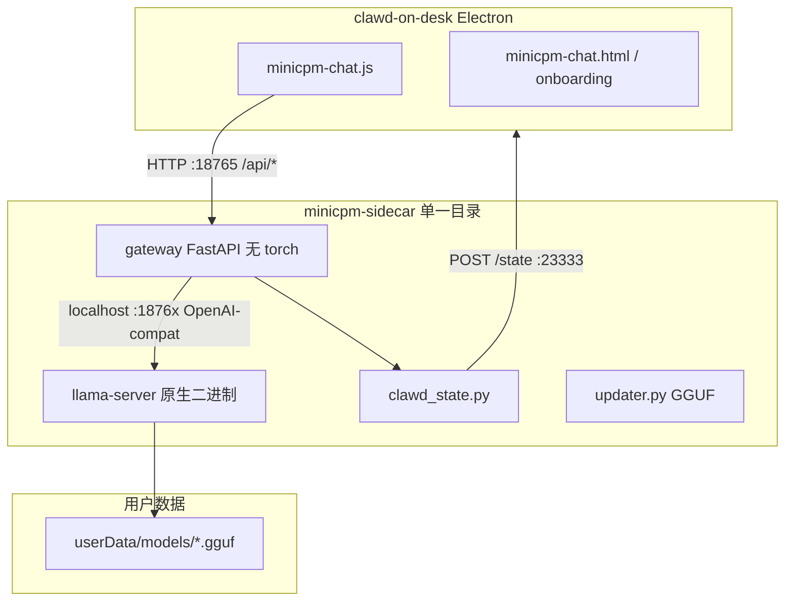

# 推理栈迁移：PyTorch → Llama.cpp（v0.8）

> 日期：2026-05-20  
> 实施者：项目负责人 + Cursor 协作

## TL;DR

把端侧推理从 `torch + transformers (+ peft)` 切换到 [llama.cpp](https://github.com/ggml-org/llama.cpp) 的 `llama-server`，外面包一层瘦 FastAPI gateway 维持对 Electron 的 HTTP/SSE 契约。删除了两套近乎重复的 Python bridge，整合为单一 [`minicpm-sidecar/`](../minicpm-sidecar/) 目录。

## 为什么迁移

| 维度 | PyTorch 旧方案 | llama.cpp 新方案 |
|------|---------------|------------------|
| 安装包体积（mac dmg） | ~700 MB（torch 嵌入） | ~30 MB gateway + ~10–30 MB llama-server |
| 跨平台 wheel 复杂度 | 每平台不同 wheel + CUDA index | 各平台 cmake 出一个 `llama-server` |
| 冷启动内存 | 1.5–2 GB（python + torch + 权重） | 600 MB – 1 GB（GGUF mmap） |
| MPS 稳定性 workaround | `attn_implementation=eager`、`PYTORCH_ENABLE_MPS_FALLBACK=1` | 上游成熟 Metal 后端 |
| Dev 环境 | conda / uv + `torch` | uv + cmake（无 ML 框架） |
| LoRA 热切换 | PEFT 整模型 reload ~3-4s | v1 暂未支持（v2 路线） |

跨平台分发是主要驱动：PRD 北极星指标里 Windows 装包 ≤ 2.5 GB / mac ≤ 1.5 GB 在旧方案下需要把 torch 嵌入，余量几乎为零。新方案把 torch 整层抹掉。

## 架构

Gateway 与 llama-server 同住一个 sidecar binary 旁；Electron 只 spawn 一个进程，gateway 自行管理 llama-server 子进程生命周期（启动、健康轮询、`/api/load-model` 时重启换模型）。

## 已实现 / 未实现

### v1（本次落地）

- `GET /api/health`、`POST /api/chat (SSE)`、`POST /api/warmup`
- `GET /api/models`、`POST /api/load-model`
- `GET /api/devices`、`POST /api/set-device`、`GET /api/onboarding`
- `GET /api/update-check`、`POST /api/update-apply (SSE)` — GGUF 单文件下载
- `POST /api/state`
- 桌宠状态推送（`ClawdBridge`）行为完全一致
- `ThinkBlockFilter` `<think>...</think>` 拆分逻辑原样移植 + 单元测试锁定
- Electron 端 spawn 简化：删除 conda / uv venv / `/bin/bash` 分支，只保留 packaged binary 或 `MINICPM_SIDECAR_DIR + .venv/bin/python -m gateway`

### v1 stub（保持 Electron 调用 200/501，不影响主路径）

| 端点 | 行为 |
|------|------|
| `POST /api/classify` | 501 |

### v2（已落地）

- LoRA：PEFT → GGUF LoRA + `/api/load-adapter` + `disable_adapter`（旁白绕过人格）— shipped. 实现走 llama.cpp PR #10994 的 per-request `lora` 字段，gateway 维护一个 in-memory `current_adapter`，主对话注入 `[{id, scale}]`，旁白注入 `[]`，无并发锁、无全局污染。详见 [minicpm-sidecar/README.md](../minicpm-sidecar/README.md#lora-适配器协议) 和 [adapters/README.md](../adapters/README.md)。
- 用户可在 Settings → 🐾 MiniCPM → 人格 LoRA 里单选激活，并通过「打开 adapters 目录」拖入自己的 `.gguf` 适配器。

### v2 路线（剩余）

- `/api/classify`：用 llama-server logprobs 或短生成实现
- 切换至 ggml-org 官方 MiniCPM5 tokenizer 合并后的 llama.cpp（当前 vendor `zhangtao2-1/llama.cpp` PR [#23384](https://github.com/ggml-org/llama.cpp/pull/23384) 提交）

## 关键代码改动

| 模块 | 旧 | 新 |
|------|---|---|
| Python sidecar | `minicpm-pet-bridge/server.py`（v0.9 已删除，参考 git 历史） | [`minicpm-sidecar/gateway/server.py`](../minicpm-sidecar/gateway/server.py) |
| Pet 状态推送 | `minicpm-pet-bridge/clawd_state.py`（v0.9 已删除） | [`minicpm-sidecar/gateway/clawd_state.py`](../minicpm-sidecar/gateway/clawd_state.py)（原样） |
| Think 块拆分 | `server.py` 内 `ThinkBlockFilter` | [`minicpm-sidecar/gateway/think_filter.py`](../minicpm-sidecar/gateway/think_filter.py) + [`tests/test_think_filter.py`](../minicpm-sidecar/tests/test_think_filter.py) |
| 更新器 | `updater.py`（HF snapshot 整仓） | [`minicpm-sidecar/gateway/updater.py`](../minicpm-sidecar/gateway/updater.py)（GGUF 单文件 + revision.json） |
| Electron spawn | `locatePython()` 三路：conda/uv/explicit + `/bin/bash` viaShell | [`clawd-on-desk/src/minicpm-chat.js`](../clawd-on-desk/src/minicpm-chat.js) `locateSidecarBinary` / `locateSidecarSourceDir` / `locatePython` — 仅 packaged binary + dev venv |
| Onboarding 选本地模型 | dialog → 选目录 → 校验 `config.json` | 同 dialog → 接受 `.gguf` 文件或包含 `.gguf` 的目录 |
| 打包 | `extraResources` → `minicpm-pet-bridge-uv/` 源码子集 + adapters（v0.9 已删除该目录） | 仅 `minicpm-sidecar/bin/<triple>/` + 瘦 source |
| 构建脚本 | `build/build-sidecar.sh`（torch 700MB，v0.9 已删除） | [`minicpm-sidecar/scripts/build-all.sh`](../minicpm-sidecar/scripts/build-all.sh) |

## CI

- [`.github/workflows/build-sidecar.yml`](../.github/workflows/build-sidecar.yml) — 跨平台构建 llama-server + gateway，sanity-check + 上传 artifact。
- [`.github/workflows/release.yml`](../.github/workflows/release.yml) — tag push 触发，每个平台 inline 编 sidecar 后跑 electron-builder，统一上传到 GitHub Release。

## 测试

- Gateway 纯逻辑（[`minicpm-sidecar/tests/`](../minicpm-sidecar/tests/)）：`uv run pytest`。
  - `test_think_filter.py` — 7 个场景覆盖 think 块拆分（含跨 chunk 拼接、`start_inside=True`）。
  - `test_discover_models.py` — `/api/models` 的 GGUF 扫描行为（递归、跳过 staging/backup、直接文件）。
  - `test_llama_client_payload.py` — `chat_template_kwargs.enable_thinking` 透传 + `top_k=0` 不被吞，确保 `thinking:false` 真的关 reasoning。
- Electron locator（[`clawd-on-desk/test/minicpm-locate.test.js`](../clawd-on-desk/test/minicpm-locate.test.js)）：`npm test` 跑 8 个测试覆盖 sidecar binary / source dir / Python 解释器解析。

### 端到端 / Q4_K_M 实测（M4 Pro / 18 GB / Metal）

用 `/Users/huang/Downloads/MiniCPM5-0.9B-mac/artifacts/gguf/MiniCPM5-0.9B-Q4_K_M.gguf` 实测：

| 项 | 结果 |
|------|------|
| `llama-server --version` | `version: 1 (c5ede29)` AppleClang Darwin arm64 |
| Q4_K_M 模型加载到 health=ok | ~4 秒（Metal embed library 已嵌入） |
| 推理 throughput | ~198 tok/s |
| 中文 prompt 输入 → 中文回复 | ✅ "你好，请用一句话介绍你自己" → "我是 MiniCPM 系列模型，由面壁智能…" |
| `thinking:true` 流式 | 同时拿到 284 帧 `event:think` + 14 帧 `event:delta` |
| `thinking:false` 流式 | 仅 `event:delta`，reasoning 真正关掉（短预算不再产空 content） |
| `POST /api/load-model` 热切换 Q4_K_M→Q8_0 | ~3 秒，内部 llama-server 子进程重启，gateway 端口不变 |
| `/api/warmup` 往返 | ~20 ms（命中 prompt cache） |

### 修复记录（实测中发现）

1. **`llama-server --jinja` 把 reasoning 拆到 `delta.reasoning_content`**，gateway 之前只读 `delta.content` 会丢掉整段 think。已让 `llama_client.stream_chat` 改为 yield `(kind, text)` 两元组，由 gateway 把 reasoning 路由到 `event:think`。
2. **`thinking:false` 在旧实现下只是"隐藏"reasoning，模型仍然生成它，导致小预算下 content 为空**。修复为透传 `chat_template_kwargs.enable_thinking=false` 给 llama-server，让模板真正跳过 `<think>` prefill。语义与旧 PyTorch sidecar 的 `enable_thinking` 完全一致。

剩余：Electron 端的人工冒烟（`./go.sh` → Onboarding → 气泡对话）将在你完成 UI 侧 dogfood 时验证。后端协议层已闭环。

## Vendor 风险与升级路径

PR #23384 被 maintainer 关闭（要求不要把 regex 存进 GGUF、走 `convert_hf_to_gguf_update.py` 自动化）。我们目前 pin 在 `zhangtao2-1/llama.cpp@c5ede29`，作为 **短期** tokenizer 方案。

升级到上游正式版的步骤：

1. 改 [`minicpm-sidecar/scripts/clone-llama.sh`](../minicpm-sidecar/scripts/clone-llama.sh) 的 `REMOTE` / `REF` 到 `ggml-org/llama.cpp` 对应 tag。
2. `./scripts/build-all.sh` 重出 artifact。
3. 跑一遍 golden prompt 对比（同输入 vs 旧版 HF 模型，首 token + 整句一致性）。
4. 提交对应 commit + tag，触发 CI 新一轮 release。

## 旧目录处置

v0.8 阶段曾保留以下三个目录并标记 DEPRECATED：

- `minicpm-pet-bridge/`（conda + PyTorch sidecar 源码）
- `minicpm-pet-bridge-uv/`（uv 版同源 sidecar）
- `build/`（旧 PyInstaller spec 与脚本）

v2 LoRA 链路已在 v0.8 末期通过 GGUF 适配器落地，这些目录在 v0.9 仓库
开源前一次性删除。如需历史代码，请查阅 `v0.8.x` 之前的 git 历史。
